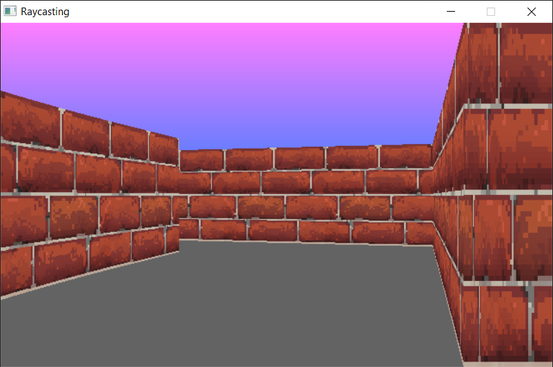

# Raycasting in C - Part 2



## Building the project

Compile by running

```
make
```

## Run it

```
./bin/Raycast
```

---

## Have any questions?

Feel free to contact me to: rdparedessalazar@gmail.com